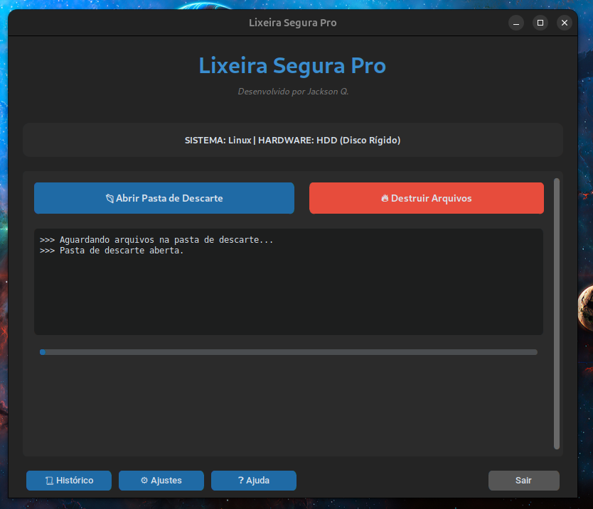
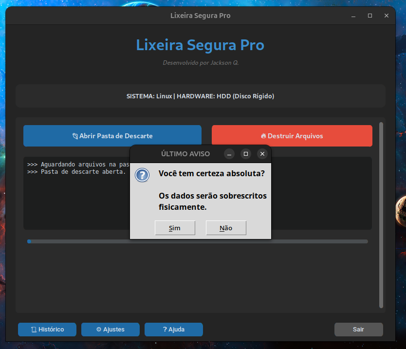
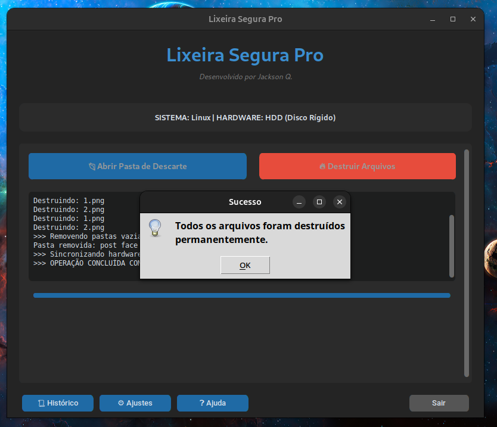

# 🗑️ Lixeira Segura Pro v1.0

[](https://opensource.org/licenses/MIT)
[](https://www.python.org/)
[](https://www.linux.org/)
[](https://github.com/TomSchimansky/CustomTkinter)

---

# 📌 Sobre

**Lixeira Segura Pro** é um aplicativo gráfico para Linux desenvolvido em **Python** utilizando **CustomTkinter**, criado para destruir arquivos de forma segura utilizando técnicas de sobrescrita compatíveis com discos HDD e SSD.

Ao contrário da exclusão tradicional do sistema operacional, o programa utiliza o utilitário **shred**, reduzindo significativamente a possibilidade de recuperação dos arquivos por ferramentas comuns de recuperação de dados.

Foi desenvolvido pensando em usuários domésticos, empresas e profissionais que desejam descartar informações confidenciais com mais segurança.

---

# 📸 Capturas de Tela

| Tela Principal         | Processo de Exclusão   |
| ---------------------- | ---------------------- |
|  |  |

| Confirmação
| ---------------------- |
|  |

---

# ✨ Recursos

* Interface gráfica moderna utilizando **CustomTkinter**
* Exclusão segura utilizando **shred**
* Detecção automática do tipo de armazenamento

  * HDD
  * SSD
  * NVMe
* Método de destruição adequado para cada tipo de disco
* Confirmação dupla antes da exclusão
* Histórico das exclusões realizadas
* Configurações do aplicativo
* Barra de progresso
* Exclusão de arquivos dentro de subpastas
* Remoção automática das pastas vazias após a destruição
* Organização automática dos diretórios do programa
* Compatível com Ubuntu e distribuições baseadas em Debian
* Geração de pacote **.deb**

---

# 🔒 Método de Exclusão

## HDD (Disco Rígido)

Em discos rígidos tradicionais o programa utiliza:

```bash
shred -f -u -z -n 3
```

Este método:

* sobrescreve o arquivo três vezes;
* realiza uma última sobrescrita com zeros;
* remove o arquivo do sistema.

Esse é um dos métodos mais seguros disponíveis para HDDs.

---

## SSD / NVMe

Em SSDs e NVMe o programa utiliza:

```bash
shred -f -u -n 1
sync
```

Em dispositivos de memória flash existe o mecanismo de **Wear Leveling** e **TRIM**, que são gerenciados pelo próprio controlador do SSD.

Por esse motivo, nenhum software consegue garantir sobrescrita física absoluta de um arquivo específico em todos os SSDs.

Mesmo assim, para a grande maioria dos cenários, a recuperação utilizando ferramentas comuns torna-se extremamente difícil ou inviável.

---

# 📁 Estrutura Criada

Na primeira execução será criada automaticamente a seguinte estrutura:

```text
~/Lixeira_Segura/

├── apagar_aqui/
├── logs/
│   └── exclusoes.log
└── config.json
```

## apagar_aqui

Coloque nesta pasta:

* arquivos;
* pastas;
* subpastas.

O programa localizará todos os arquivos automaticamente.

Após destruir todos os arquivos, as pastas vazias serão removidas automaticamente.

---

# 🚀 Instalação

Clone o projeto:

```bash
git clone https://github.com/Jackson-077/Lixeira-Segura-Pro.git
```

Entre na pasta:

```bash
cd Lixeira-Segura-Pro
```

Dê permissão aos scripts:

```bash
chmod +x setup_projeto.sh
chmod +x gerar_deb.sh
```

Configure o ambiente:

```bash
./setup_projeto.sh
```

O script criará automaticamente:

* ambiente virtual (venv);
* instalação das dependências;
* script `run.sh`.

Depois basta executar:

```bash
./run.sh
```

---

# 📦 Gerando o Instalador .deb

Após configurar o ambiente:

```bash
./gerar_deb.sh
```

Será criado um pacote semelhante a:

```text
lixeira-segura_1.0.0_amd64.deb
```

Instalação:

```bash
sudo apt install ./lixeira-segura_1.0.0_amd64.deb
```

---

# 📋 Requisitos

* Linux
* Python 3.10 ou superior
* Ambiente gráfico
* utilitário `shred`
* utilitário `sync`

As bibliotecas Python são instaladas automaticamente pelo script de configuração.

---

# 📚 Tecnologias Utilizadas

* Python
* CustomTkinter
* Pillow
* PyInstaller
* Bash
* Debian Packaging

---

# ⚠️ Aviso Importante

Embora o programa utilize técnicas de destruição segura compatíveis com HDDs e SSDs, nenhum software pode garantir a eliminação física absoluta de um único arquivo em todos os dispositivos de armazenamento, especialmente em SSDs devido ao funcionamento interno do controlador.

Para informações extremamente sensíveis, recomenda-se utilizar criptografia de disco e os recursos de apagamento seguro fornecidos pelo fabricante do dispositivo.

---

# 👨‍💻 Autor

**Jackson Q.**

Projeto desenvolvido com foco em privacidade, segurança digital e facilidade de uso para sistemas Linux.

---

# 📄 Licença

Este projeto está licenciado sob a **Licença MIT**.

Consulte o arquivo **LICENSE** para mais informações.
